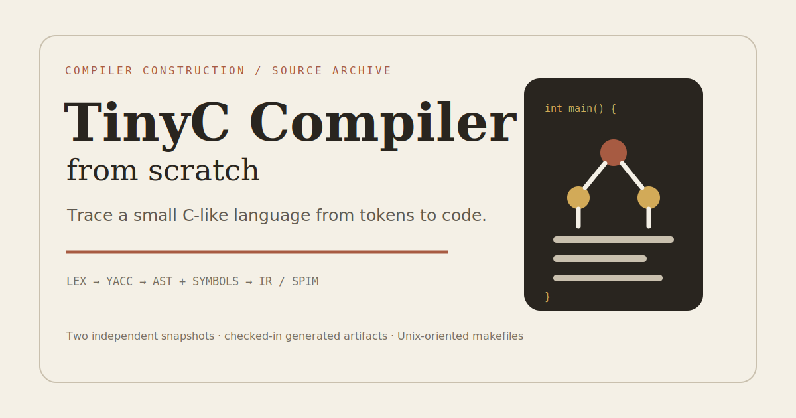
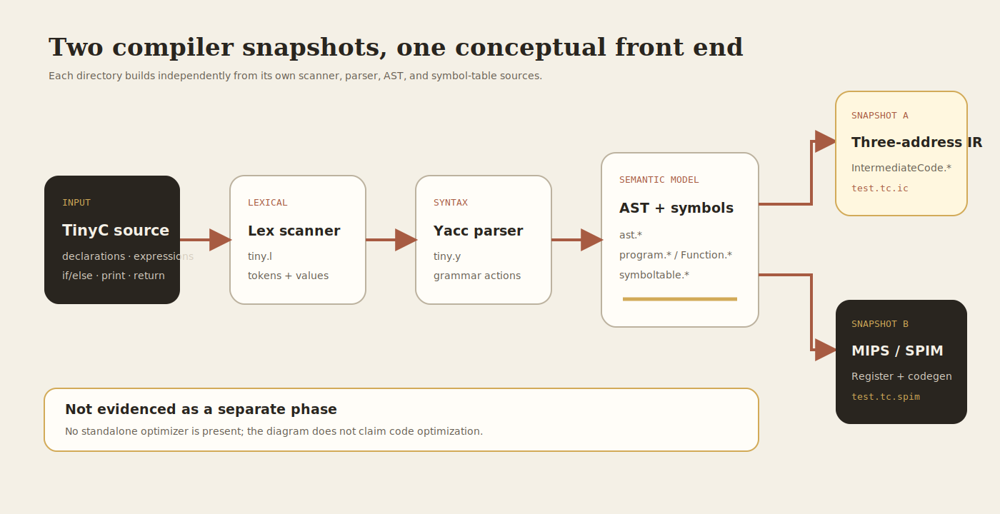

<div align="center">
  

# TinyC Compiler from Scratch

**Two C++ compiler snapshots that trace a small C-like language from Lex/Yacc parsing to intermediate and SPIM target code.**

[](#implementation-map)
[](#quick-start)
[](#scope-and-limitations)

[Quick start](#quick-start) · [Language](#supported-language) · [Architecture](#architecture) · [Outputs](#cli-and-outputs) · [Limitations](#scope-and-limitations)

</div>

<div align="center">
  
</div>

## What is it?

This repository contains two independent stages of an educational TinyC compiler. Both implement a scanner, parser, abstract syntax tree, program/function model, and symbol table. One snapshot emphasizes three-address intermediate code; the other adds register and MIPS/SPIM code generation.

The projects are source archives rather than a single versioned compiler. Generated Lex/Yacc files, object files, executables, and sample outputs are committed alongside the handwritten sources.

## Quick start

Prerequisites on a Unix-like system:

- C++ compiler and Make
- Lex/Flex plus its runtime library
- Yacc/Bison plus its runtime library

### Generate intermediate code

```bash
cd intermediate-code-generation
make
./tinyC -ic test1.tc
```

The command writes `test1.tc.ic`. A checked-in example is available at [`test1.tc.ic`](intermediate-code-generation/test1.tc.ic).

### Generate SPIM target code

```bash
cd target-code-generation
make
./tinyC -compile test1.tc
```

The command writes `test1.tc.spim`. Compare it with the checked-in [`sample output`](target-code-generation/test1.tc.spim).

If your platform exposes `flex`/`bison` but not the traditional `lex`/`yacc` commands or libraries, adjust the directory makefile locally.

## Supported language

The committed Level-2 grammar describes a deliberately small language:

- `int main()` program shape
- local `int` and `double` declarations
- integer and double constants
- assignments and arithmetic `+ - * / %`
- relational and logical expressions
- `if` / `else`
- `print` statements
- `return 0`

See [`BNFGrammar_ Level-2(TinyC-simple-integer-assignments-operators).txt`](intermediate-code-generation/BNFGrammar_%20Level-2%28TinyC-simple-integer-assignments-operators%29.txt) for the repository’s grammar reference.

## Architecture



## Implementation map

| Concern | Intermediate-code snapshot | Target-code snapshot |
| --- | --- | --- |
| Scanner / parser | `tiny.l`, `tiny.y` | `tiny.l`, `tiny.y` |
| Semantic structures | `ast.*`, `program.*`, `Function.*`, `symboltable.*` | Same core structure |
| Additional stage | `IntermediateCode.*` | `Register.*`, `codegeneration.*`, `machinedescription.*` |
| Sample output | `.ic` | `.spim` |

## CLI and outputs

The generated `tinyC` programs expose options implemented in `tiny.y`:

| Option | Purpose |
| --- | --- |
| `-toks <file.tc>` | Write token output |
| `-ast <file.tc>` | Write the abstract syntax tree |
| `-symtab <file.tc>` | Write the symbol table |
| `-ic <file.tc>` | Write intermediate code; available in the intermediate snapshot |
| `-compile <file.tc>` | Write SPIM code |

Running with only the source path parses and prints diagnostic structures according to the selected snapshot.

## Scope and limitations

- This is an educational compiler subset, not a conforming C compiler.
- The two directories duplicate front-end code and should be treated as separate snapshots.
- No standalone optimization pass is present, so the README does not claim code optimization.
- Build scripts assume Unix tools and link with `-ll` and `-ly`.
- Generated parser/scanner sources, object files, binaries, editor swap files, and outputs are checked in.
- No automated test runner or CI configuration is provided; sample `.tc`, `.ic`, and `.spim` files are the available fixtures.
- A license exists only inside `target-code-generation/`; the repository root does not define one license for both snapshots.
